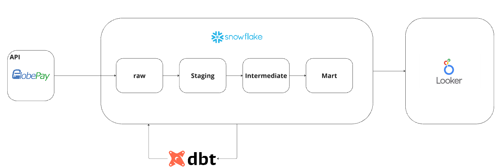
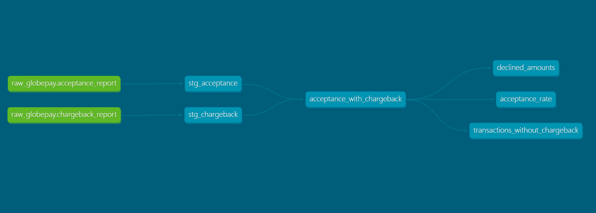

# Deel
## Project of Deel home task for Analytics Engineer position.

### Data exploration
The files contain a key that can be related to each other in a 1:1 relationship. Both have 5,430 records spanning over six months, between December 31, 2018, and June 30, 2019. For more information about column descriptions, read the table documentation.

Within the [models](deel_dbt_project/models/) folder, we have three zones classified as staging, intermediate, and marts.

### Zones
- [staging](deel_dbt_project/models/staging/): Where data is tabulated, and SQLs are organized to materialize views and tables that will serve as the database foundation for relationships in the intermediate zone. 
 
- [intermediate](deel_dbt_project/models/intermediate/): Where JSON is broken down into columns, grouping and relationships of tables, views, and data originating from staging zone occur.

- [marts](deel_dbt_project/models/marts/): Where relationships are built between any tables, considering the analyst's needs. The marts are divided into schemas that concentrate specific information.

Within each zone, there are two folders:
  
  - [config](deel_dbt_project//models/staging/config/) ->  Where the YML configuration files for each table are located. 
 
  - [sql](deel_dbt_project//models/staging/sql/) -> Where the SQL files for querying and building each table are located.

### Linage graph:

### Dashboard link:
[Dashboard](https://lookerstudio.google.com/reporting/9e7aba23-0ba4-4b9b-b036-36f0c891aa33)

Sugestions:
* A line chart is better for tracking the acceptance rate, as it is necessary to observe trends over time.
* A bar chart is recommended for countries where the amount of declined transactions exceeded $25 million, because it allows for an easier comparison in a top-down list.
* Since you only need to identify transactions with missing chargeback data, a single-column table would be suitable.

### Note:
If rates are required as structured data, they are available in the table intermediate.acceptance_with_chargeback. 
Should the column change, it will be detected and materialized with the new exchange rate.
The logic it's in (/macros/currency_rates.sql)